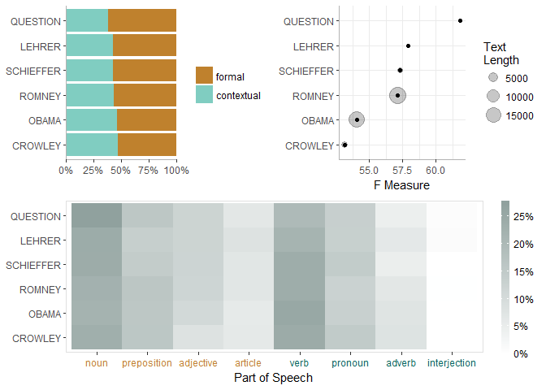
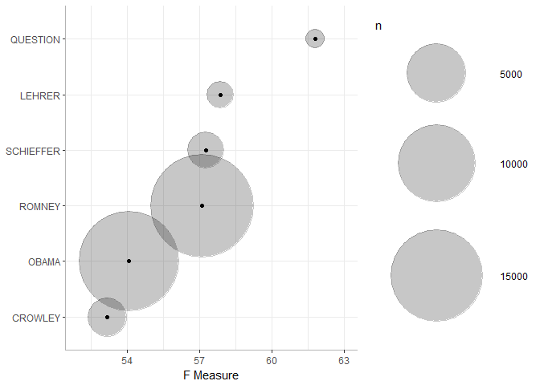
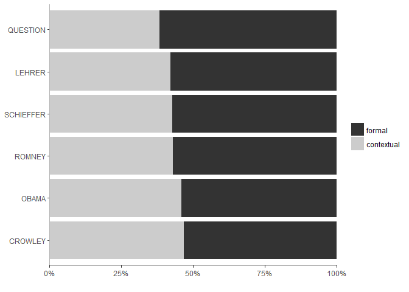
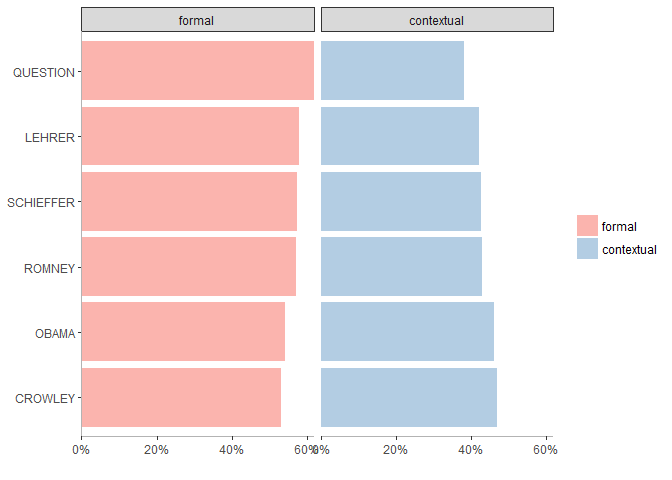
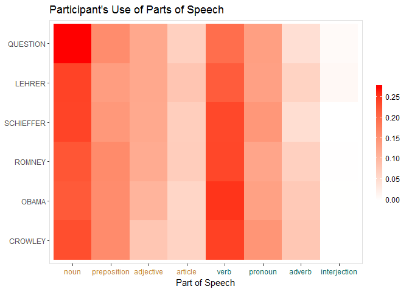
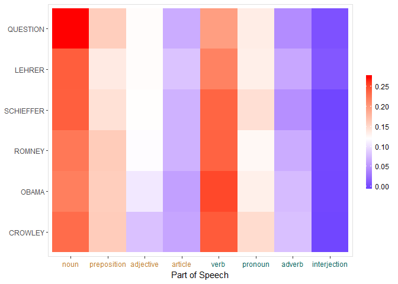

formality   
============

**formality** utilizes the
[**tagger**](https://github.com/trinker/tagger) package to conduct
formality analysis. Heylighen (1999) and Heylighen & Dewaele (2002,
1999) have given the *F-measure* as a measure of how *contextual* or
*formal* language is. Language is considered more formal when it
contains much of the information directly in the text, whereas,
contextual language relies on shared experiences to more efficiently
dialogue with others.

Formality Equation
==================

The **formality** package's main function is also titled `formality` and
uses Heylighen & Dewaele's (1999) *F-measure*. The *F-measure* is
defined formally as:

*F* = 50(((*n**f* − *n**c*)/*N*)+1)

Where:

*f* = {*n**o**u**n*, *a**d**j**e**c**t**i**v**e*, *p**r**e**p**o**s**i**t**i**o**n*, *a**r**t**i**c**l**e*}
  
*c* = {*p**r**o**n**o**u**n*, *v**e**r**b*, *a**d**v**e**r**b*, *i**n**t**e**r**j**e**c**t**i**o**n*}
  
*N* = *n**f* + *n**c*

This yields an *F-measure* between 0 and 100%, with completely
contextualized language on the zero end and completely formal language
on the 100 end.

Please see the following references for more details about formality and
the *F-measure*:

-   Heylighen, F. (1999). Advantages and limitations of
    formal expression. Foundations of Science, 4, 25-56.
    <a href="http://link.springer.com/article/10.1023%2FA%3A1009686703349">doi:10.1023/A:1009686703349</a>
-   Heylighen, F. & Dewaele, J.-M. (1999). Formality of language:
    Definition, measurement and behavioral determinants. Center "Leo
    Apostel", Free University of Brussels. Retrieved from
    <http://pespmc1.vub.ac.be/Papers/Formality.pdf>
-   Heylighen, F. & Dewaele, J.-M. (2002). Variation in the
    contextuality of language: An empirical measure. Foundations of
    Science, 7(3), 293-340.
    <a href="http://link.springer.com/article/10.1023%2FA%3A1019661126744">doi:10.1023/A:1019661126744</a>

Table of Contents
============

-   [Formality Equation](#formality-equation)
-   [Installation](#installation)
-   [Contact](#contact)
-   [Examples](#examples)
    -   [Load the Tools/Data](#load-the-toolsdata)
    -   [Assessing Formality](#assessing-formality)
    -   [Recycling the First Run](#recycling-the-first-run)
    -   [Plotting](#plotting)

Installation
============

To download the development version of **formality**:

Download the [zip
ball](https://github.com/trinker/formality/zipball/master) or [tar
ball](https://github.com/trinker/formality/tarball/master), decompress
and run `R CMD INSTALL` on it, or use the **pacman** package to install
the development version:

    if (!require("pacman")) install.packages("pacman")
    pacman::p_load_gh(c(
        "trinker/termco", 
        "trinker/tagger", 
        "trinker/formality"
    ))

Contact
=======

You are welcome to:    
- submit suggestions and bug-reports at: <https://github.com/trinker/formality/issues>    
- send a pull request on: <https://github.com/trinker/formality/>    
- compose a friendly e-mail to: <tyler.rinker@gmail.com>    

Examples
========

The following examples demonstrate some of the functionality of
**formality**.

Load the Tools/Data
-------------------

    library(formality)
    data(presidential_debates_2012)

Assessing Formality
-------------------

`formality` takes the text as `text.var` and any number of grouping
variables as `grouping.var`. Here we use the `presidential_debates_2012`
data set and look at the formality of the people involved. Note that for
smaller text Heylighen & Dewaele (2002) state:

> At present, a sample would probably need to contain a few hundred
> words for the measure to be minimally reliable. For single sentences,
> the F-value should only be computed for purposes of illustration" (p.
> 24).

    form1 <- with(presidential_debates_2012, formality(dialogue, person))
    form1

    ##       person noun preposition adjective article verb pronoun adverb
    ## 1:  QUESTION  155          91        70      38  112      77     26
    ## 2:    LEHRER  182         104        93      62  164     101     48
    ## 3: SCHIEFFER  347         209       176     102  342     211     69
    ## 4:    ROMNEY 4406        3178      2346    1396 4676    2490   1315
    ## 5:     OBAMA 3993        2909      1935    1070 4593    2418   1398
    ## 6:   CROWLEY  387         269       135     104  405     249    134
    ##    interjection formal contextual     n        F
    ## 1:            4    354        219   573 61.78010
    ## 2:            8    441        321   762 57.87402
    ## 3:            0    834        622  1456 57.28022
    ## 4:           25  11326       8506 19832 57.10972
    ## 5:           13   9907       8422 18329 54.05096
    ## 6:            0    895        788  1683 53.17885

Recycling the First Run
-----------------------

This will take ~20 seconds because of the part of speech tagging that
must be undertaken. The output can be reused as `text.var`, cutting the
time to a fraction of the first run.

    with(presidential_debates_2012, formality(form1, list(time, person)))

    ##       time    person noun preposition adjective article verb pronoun
    ##  1: time 2  QUESTION  155          91        70      38  112      77
    ##  2: time 1    LEHRER  182         104        93      62  164     101
    ##  3: time 1    ROMNEY  950         642       483     286  978     504
    ##  4: time 3    ROMNEY 1766        1388       958     617 1920    1029
    ##  5: time 3 SCHIEFFER  347         209       176     102  342     211
    ##  6: time 2    ROMNEY 1690        1148       905     493 1778     957
    ##  7: time 3     OBAMA 1546        1185       741     432 1799     973
    ##  8: time 1     OBAMA  792         579       357     219  925     452
    ##  9: time 2     OBAMA 1655        1145       837     419 1869     993
    ## 10: time 2   CROWLEY  387         269       135     104  405     249
    ##     adverb interjection formal contextual    n        F
    ##  1:     26            4    354        219  573 61.78010
    ##  2:     48            8    441        321  762 57.87402
    ##  3:    240            4   2361       1726 4087 57.76853
    ##  4:    536           10   4729       3495 8224 57.50243
    ##  5:     69            0    834        622 1456 57.28022
    ##  6:    539           11   4236       3285 7521 56.32230
    ##  7:    522            4   3904       3298 7202 54.20716
    ##  8:    281            2   1947       1660 3607 53.97838
    ##  9:    595            7   4056       3464 7520 53.93617
    ## 10:    134            0    895        788 1683 53.17885

Plotting
--------

The generic `plot` function provides three views of the data:

1.  A filled bar plot of formal vs. contextual usage
2.  A dotplot of formality\*\*
3.  A heatmap of the usage of the parts of speech used to calculate the
    formality score

\*\****Note*** *red dot in center is a warning of less than 300 words*

    plot(form1)

The `plot` function uses **gridExtra** to stitch the plots together,
which is plotted imediately. However, the three subplots are actually
returned as a list as seen below.

    names(plot(form1, plot=FALSE))

    ## [1] "formality"         "contextual_formal" "pos"

Each of these is a **ggplot2** object that can be further manipulated
with various scales, facets, and annotations. I demonstrate some of this
functionality in the plots below.

    library(ggplot2)
    plot(form1, plot=FALSE)[[1]] +
        scale_size(range= c(8, 45)) +
        scale_x_continuous(limits = c(52, 63))

    plot(form1, plot=FALSE)[[2]] +
        scale_fill_grey()

    plot(form1, plot=FALSE)[[2]] +
        scale_fill_brewer(palette = "Pastel1") +
        facet_grid(~type)

    plot(form1, plot=FALSE)[[3]] +
        scale_fill_gradient(high = "red", low="white") +
        ggtitle("Participant's Use of Parts of Speech")

    plot(form1, plot=FALSE)[[3]] +
        scale_fill_gradient2(midpoint=.12, high = "red", low="blue")

