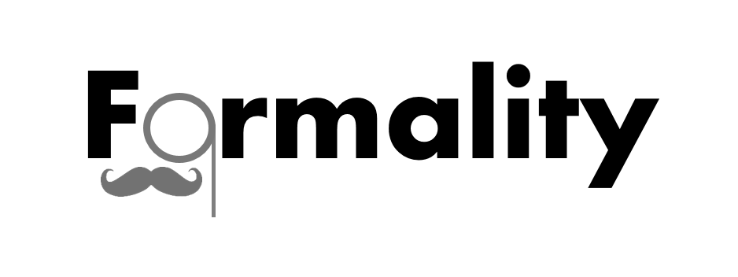

formality
============

**formality** utilizes the
[**tagger**](https://github.com/trinker/tagger) package to conduct
formality analysis. Heylighen (1999) and Heylighen & Dewaele (2002,
1999) have given the *F-measure* as a measure of how *contextual* or
*formal* language is. Language is considered more formal when it contains
much of the information directly in the text, whereas, contextual
language relies on shared experiences to more efficiently dialogue with
others.

The **formality** package's main function is also titled `formality` and
uses Heylighen & Dewaele's (1999) *F-measure*. The *F-measure* is
defined formally as:

*F* = 50(((*n**f* − *n**c*)/*N*) + 1)

Where:

*f* = {*n**o**u**n*, *a**d**j**e**c**t**i**v**e*, *p**r**e**p**o**s**i**t**i**o**n*, *a**r**t**i**c**l**e*}
  
*c* = {*p**r**o**n**o**u**n*, *v**e**r**b*, *a**d**v**e**r**b*, *i**n**t**e**r**j**e**c**t**i**o**n*}
  
*N* = *n**f* + *n**c*

This yields an *F-measure* between 0 and 100%, with completely
contextualized language on the zero end and completely formal language
on the 100 end.

Please see the following references for more details about formality and
the *F-measure*:

-   Heylighen, F. (1999). Advantages and limitations of formal
    expression. Foundations of Science, 4, 25-56.
    <a href="http://link.springer.com/article/10.1023%2FA%3A1009686703349">doi:10.1023/A:1009686703349</a>
-   Heylighen, F. & Dewaele, J.-M. (1999). Formality of language:
    Definition, measurement and behavioral determinants. Center "Leo
    Apostel", Free University of Brussels. Retrieved from
    [<http://pespmc1.vub.ac.be/Papers/Formality.pdf>](http://pespmc1.vub.ac.be/Papers/Formality.pdf)
-   Heylighen, F. & Dewaele, J.-M. (2002). Variation in the
    contextuality of language: An empirical measure. Foundations of
    Science, 7(3), 293-340.
    <a href="http://link.springer.com/article/10.1023%2FA%3A1019661126744">doi:10.1023/A:1019661126744</a>

Table of Contents
============

-   [Installation](#installation)
-   [Contact](#contact)

Installation
============

To download the development version of **formality**:

Download the [zip
ball](https://github.com/trinker/formality/zipball/master) or [tar
ball](https://github.com/trinker/formality/tarball/master), decompress
and run `R CMD INSTALL` on it, or use the **pacman** package to install
the development version:

    if (!require("pacman")) install.packages("pacman")
    pacman::p_load_gh("trinker/formality")

Contact
=======

You are welcome to: 
* submit suggestions and bug-reports at: <https://github.com/trinker/formality/issues> 
* send a pull request on: <https://github.com/trinker/formality/> 
* compose a friendly e-mail to: <tyler.rinker@gmail.com>
